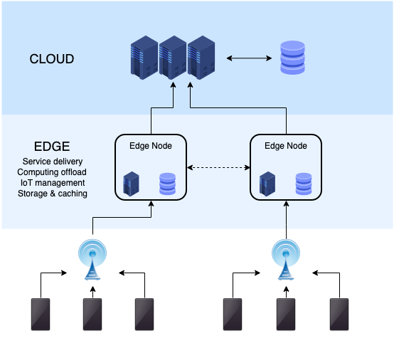

<!-- deno-fmt-ignore-file -->

---

title: What does deploying to the edge mean?
publish_date: 2022-07-11

---

In my [previous blog post](/20220708), I talked about deploying to the edge. At that time I did not know what it meant. I did some research and learned more about it.

## Traditional Deployment

When we deploy an application, we usually will deploy it to some computer in the cloud. AWS, Google Cloud, Azure all provide servers that enable us to deploy our applications. However, unless you are some super rich person, we can only afford one of these cloud computers at a time. This is a problem when it comes to hosting our applications, as request from all around the world has to reach that one server for a response.

To solve this problem, we usually use a CDN. CDNs also known as [Content Delivery Networks](https://www.cloudflare.com/en-gb/learning/cdn/what-is-a-cdn/) are used to deliver static files like HTML, CSS and JavaScript to the user. CDN providers like CloudFare usually store multiple caches of our main server's content in various servers worldwide. For example, if someone in Singapore wants visits our application, they will get served by the nearest such proxy servers instead of going to our main server located elsewhere in the world.

## What is the problem with traditional deployment?

CDNs are great for static assets that do not change very often like HTML, CSS and JavaScript. Setting up good caching policies will mitigate most issues with CDNs.

However, the problem is when we need to have a dynamic server that needs to run some code when a request comes in. Mostly this applies to APIs. When a request hits a API endpoint, we typically will update the database, perform some computation, etc before returning the response.

This is where traditional deployment becomes a problem. These request now will have to route to our main server for a response instead of the CDN (as they are not static). Furthermore, we also have to deal with cold starts, which happens when we do not use the server for a long period of time which might cause the server to have additional overhead of booting up before it can reply to the request.

## What does deploying to the edge mean?

In short, we can think of deploying to the edge as a CDN for dynamic servers. When we deploy an application to the edge, we are distributing the code to servers all around the world. This means that requests will be routed to the nearest server and usually they will be fast.

However, not everything is a advantage here. We will need a minimal runtime to run such applications. Node.js applications with a million `npm` packages are a definite no in this case. The bundled code needs to be at most `1MB` in size.

Edge computing may not be faster all the time. If we have a database that is hosted on a single server, the advantage of edge computing is lost as the server will now need to communicate with the database server that might be located elsewhere. In such cases, traditional deployment will be better.

To take full advantage of edge computing, we need to distribute the database around the world or use something like [Redis](https://redis.io/) as a secondary cache database.

## Why use edge deployment for this blog?

This blog is mostly static content with some server-side rendered HTML files and CSS. Therefore, we can use edge deployment for this blog as we do not need to perform any computation when a request hits the server. In fact, even if we used traditional deployment, it would still be fast as we would get served cached copies of HTML and CSS from the nearest proxy server instead of the main server.

I am using a third party Deno package which comes with its own deployment system that uses edge deployment. The advantages of edge deployment can be seen [here](https://pagespeed.web.dev/report?url=https%3A%2F%2Fblog.sivarn.com%2F). Compare the results of that with [this](https://pagespeed.web.dev/report?url=https%3A%2F%2Fsivarn.com%2F&form_factor=mobile), which uses traditional deployment with a CDN. Although this is not a fair comparison, it is a good example of how drastic the differences are.

## References

I learned most of the things in this post by reading online and watching [this video](https://www.youtube.com/watch?v=yOP5-3_WFus).
